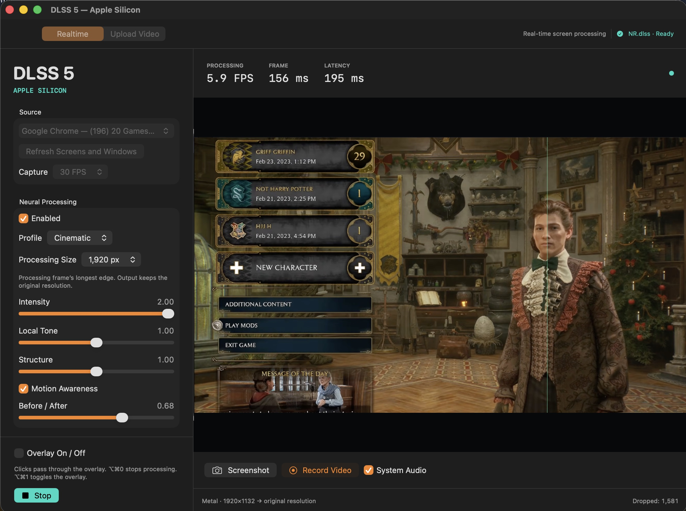
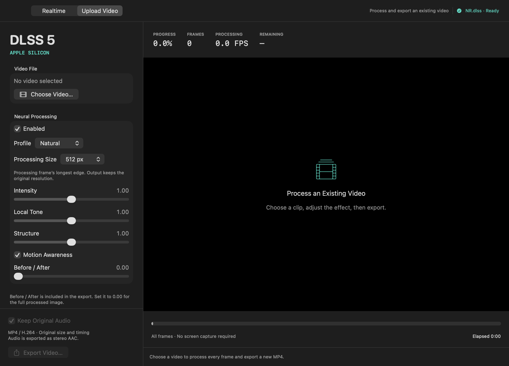

# DLSS 5 — Apple Silicon

Experimental neural image enhancement for Apple Silicon Macs, inspired by
[NeuralScreen](https://github.com/perseval-BLR/DLSS5-NeuralScreen).
A native Swift app for **Realtime** screen processing and **Upload Video** export,
powered by MLX and Metal. Independent project, not an official NVIDIA or Apple product.



Realtime NR.dlss processing of a YouTube video playing in Chrome: **~6 FPS**, using the **Cinematic** profile.

## Two workspaces

| Realtime | Upload Video |
| --- | --- |
| Capture a display or game window | Open a local SDR video |
| Click-through overlay with an on/off switch | Process every frame and export MP4/H.264 |
| Before/after comparison and PNG snapshots | Preserve original size and frame timing |
| Record MP4 with optional system audio | Optional source audio exported as stereo AAC |
| Global overlay and stop shortcuts | Progress, cancellation and Original/Result playback |

Both use **NR.dlss** automatically. The finished app embeds the model; there is no
model selector. The interface is English only.



## Requirements

- Apple Silicon Mac running macOS 26 or later.
- Full Xcode with Swift 6.2+ and the Metal Toolchain. Command Line Tools alone are
  not enough: the Metal compiler ships with Xcode.
- CMake, Ninja, and Python 3.10+ (model preparation only).

**This repository contains source code, not the prepared application or model
weights.**

## Build and run

Check the toolchain first — this catches a missing Metal compiler before any build:

```sh
make doctor
```

Then one command fetches and verifies the DLL, prepares the model, builds and launches:

```sh
make setup
```

Without the DLL release (use a DLL you already have):

```sh
make model dll=/path/to/nvngx_dlssnr.dll   # → Models/NR.dlss
make build                                 # → dist/DLSS_5_APPLE_SILICON.app
make run
```

`make help` lists every target, including `sign`, `test`, `verify`, `clean` and
`distclean` (which also deletes `Models/`). Each target wraps a script in
`scripts/`, so the same steps work directly:

```sh
./scripts/setup-and-run.sh
./scripts/prepare-model.sh /path/to/nvngx_dlssnr.dll
./scripts/build-app.sh
./Launch.command
```

`setup` downloads the DLL from the public
[NeuralScreen v1.8.2 release](https://github.com/perseval-BLR/DLSS5-NeuralScreen/releases/tag/v1.8.2),
verifies its SHA-256 against `docs/VALIDATION.md`, and caches it in git-ignored `Models/`.

The result is `dist/DLSS_5_APPLE_SILICON.app`. It embeds `NR.dlss` and runs
independently of the project folder, without Python or Xcode. Local builds use an
installed development certificate when available, with an ad-hoc fallback; they are
not notarized public releases.

[Build instructions](docs/BUILDING.md) · [Game setup](docs/TESTING_GAME.md) ·
[Video processing](docs/PROCESS_VIDEO.md)

## Quick start

**Realtime (a game).** Select **Realtime**, wait for **NR.dlss · Ready**, refresh the
sources and choose the game window. Allow Screen Recording when macOS asks. Start with
**Natural**, **512 px** and **30 FPS**, click **Start**, then enable **Overlay On / Off**.
Windowed or borderless mode is preferred for initial testing.

- **⌥⌘1** — show or hide the overlay.
- **⌥⌘0** — stop processing or cancel video export.
- **DLSS → Show Controls** — return to the settings.

**Upload Video (a saved clip).** Select **Upload Video → Choose Video…**, adjust the
effect, then click **Export Video…**. The original file stays unchanged, and processing
is local: clips are not sent to a server.

**Processing Size** is the neural network's working resolution; the displayed or exported
image keeps the source resolution. **Before / After** shows the original on the left; set it
to 0.00 for the full processed image.

## Checks

Build and test the source without model weights or screen permissions:

```sh
make verify        # or: ./scripts/verify-source.sh
```

With the model prepared and the app built:

```sh
make test          # unit tests plus the binary --self-test
dist/DLSS_5_APPLE_SILICON.app/Contents/MacOS/DLSS_5_APPLE_SILICON --video-test --output /tmp/dlss-video-tests
```

The GitHub workflow builds the Swift executable and runs model-independent unit tests.
It does not download weights, package a distributable app or publish artifacts.
Real inference and capture diagnostics require the local model and hardware.

[Validation and measured performance](docs/VALIDATION.md) ·
[Architecture](docs/ARCHITECTURE.md) · [Contributing](CONTRIBUTING.md)

## Current limits

- Enhancement adds GPU work and latency; processing FPS is not game FPS.
- SDR only. Video export requires even frame dimensions and a macOS-supported decoder.
  HDR, protected surfaces and unusual fullscreen behavior need further work.
- Video audio is mixed into stereo AAC. Captions, chapters and extra video tracks are not
  exported. Spout/Syphon and full Windows feature parity are not implemented.
- The reconstructed neural model is not guaranteed to match NVIDIA runtime output or its
  automatic masks. Individual games and long sessions need testing.
- First-frame processing includes kernel compilation and warmup.

## Credits and license

New application code is [MIT licensed](LICENSE). The original NeuralScreen license is
retained in [Resources](Resources/NeuralScreen-LICENSE.txt).
[MLX-DLSS](https://github.com/iamwavecut/MLX-DLSS) is vendored unmodified under
Apache-2.0; MLX Swift and other dependency notices are preserved separately. See
[THIRD_PARTY_NOTICES.md](THIRD_PARTY_NOTICES.md).

Model weights and NVIDIA runtime files are not included in the source repository and are
not covered by this project's MIT license. Prepared local apps embed the model, so the app
bundle is also excluded from Git. No NVIDIA DLL executes on macOS.

[Changelog](CHANGELOG.md)
